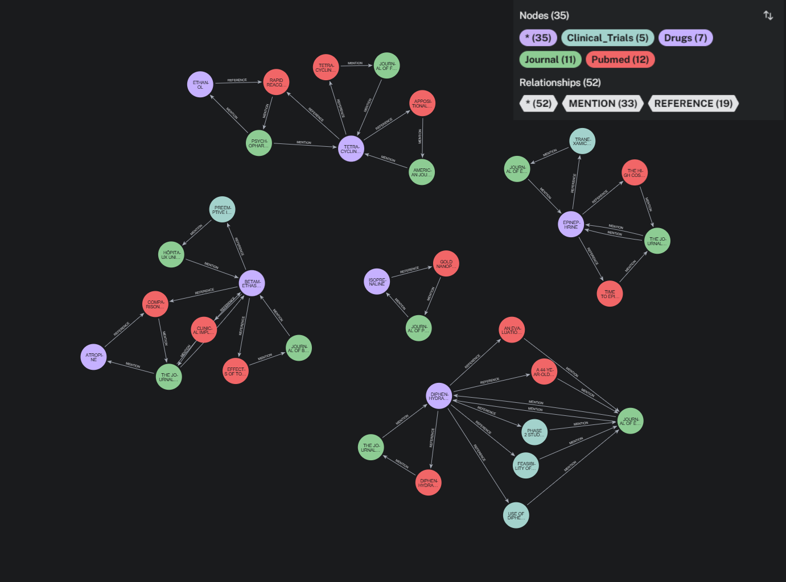

# Graph selon le modèle du pdf




## 4. Traitement ad-hoc (Bonus)

#### 1.

***Question*** :  
Extraire le nom du journal qui mentionne le plus de médicaments différents.

<br>

```
MATCH (j:Journal)-[:MENTION]->(d:Drugs)
WITH j.name AS Journal, count(DISTINCT d) AS drug_mentionned

WITH collect({Journal: Journal, count: drug_mentionned}) AS journal_counts
WITH journal_counts, reduce(maxVal = 0, jc IN journal_counts | 
     CASE WHEN jc.count > maxVal THEN jc.count ELSE maxVal END) AS max_count

UNWIND journal_counts AS jc
WITH jc
WHERE jc.count = max_count
RETURN jc.Journal AS Journal
  
```

| Journal                                             |
|-----------------------------------------------------|
| "THE JOURNAL OF MATERNAL-FETAL & NEONATAL MEDICINE" |
| "PSYCHOPHARMACOLOGY"                                |

**_Explications_** :

```
MATCH (j:Journal)-[:MENTION]->(d:Drugs)
WITH j.name AS Journal, count(DISTINCT d) AS drug_mentionned
```
Compte le nombre de médicaments distincts mentionnés par chaque journal.

```
WITH collect({Journal: Journal, count: drug_mentionned}) AS journal_counts
WITH journal_counts, reduce(maxVal = 0, jc IN journal_counts | 
CASE WHEN jc.count > maxVal THEN jc.count ELSE maxVal END) AS max_count
```
Accumule en liste les paires {journal, nombre de médicaments différents mentionnés}
Réduit la liste pour obtenir le nombre maximum de mentions.

```
UNWIND journal_counts AS jc
WITH jc
WHERE jc.count = max_count
RETURN jc.Journal AS Journal
```

Extrait les valeurs de la liste ``journal_counts`` dans la variable `jc`.
Filtre pour les ``jc`` avec le nombre de mentions égal au maximum.

<br>  

#### 2.

***Question*** :  
Pour un médicament donné, trouver l’ensemble des médicaments mentionnés par les mêmes journaux  
référencés par les publications scientifiques (PubMed) mais non les tests cliniques (ClinicalTrials)

<br>

d1.name peut être paramétrisé comme dans la fonction de Neo4jDBServer pour permettre de répondre à la question pour
n'importe quel médicament.

```
MATCH (j:Journal)-[:MENTION]->(d1:Drugs) WHERE d1.name = "TETRACYCLINE"  
MATCH (j)-[:MENTION]->(d:Drugs)-[:REFERENCE]->(:Pubmed) 
WHERE NOT (d)-[:REFERENCE]->(:Clinical_Trials) AND d.name <> d1.name  
WITH d.name as Name  
RETURN DISTINCT Name  
```

| Name      |
|-----------|
| "ETHANOL" |

**_Explications_** :

``MATCH (j:Journal)-[:MENTION]->(d1:Drugs) WHERE d1.name = "TETRACYCLINE"``

Matche toutes les relations entre MENTION entre un nœud Journal et un nœud Drugs  
quand le nœud Drugs a la propriété name égale à "TETRACYCLINE"  
assigne les nœuds Journal à la variable `j` et les nœuds Drugs à `d1`

``MATCH (j)-[:MENTION]->(d:Drugs)-[:REFERENCE]->(:Pubmed)``

Toutes les relations des journaux `j` qui mentionnent les médicaments `d` qui référencent des publications médicales

``WHERE NOT (d)-[:REFERENCE]->(:Clinical_Trials) AND d.name <> d1.name``

Où les médicaments `d` ne référencent pas d'études cliniques,  
en excluant les médicaments dont le nom est celui de la recherche initiale.

``WITH d.name as Name``  
``RETURN DISTINCT Name``

Assigne la propriété name de `d` à la variable `Name` et restitue les valeurs uniques de `Name`

<br>

## 6. Pour aller plus loin

***Question*** :  
_Quels sont les éléments à considérer pour faire évoluer votre code afin qu’il puisse gérer de grosses  
volumétries de données (fichiers de plusieurs To ou millions de fichiers par exemple) ?_

Les éléments à considérer pour faire évoluer le code pour gérer des grosses volumétries de données est  
de séparer l'ingestion pour chaque type de nœuds et de relations afin de pouvoir les paralléliser.  
Pour un gros fichier, deux approches peuvent être prises.  
Couper le fichier en partitions pour faire du batch en parallèle ou l'ingérer à la volée en streaming.  
Un fichier de taille conséquente ne peut pas tenir en mémoire vive.  

Pour des millions de fichiers, je veux garder instancié les différentes classes de nettoyage et de manipulation 
du FS.  
Le coût d'instanciation est faible unitairement, mais conséquent en cumulé pour des millions de fichiers.


***Question*** :  
_Pourriez-vous décrire les modifications qu’il faudrait apporter, s’il y en a, pour prendre en considération de
telles volumétries ?_

Pour une multitude de petits fichiers, je ferais en sorte de pouvoir multiplier les déploiements de l'application 
via docker ou kubernetes afin de pouvoir traiter un grand nombre de fichiers en simultané.  
Je modifierais le code pour que l'application se comporte comme une api qui reçoit un nom de fichier et le traite.  
Pour cela, il faut faire en sorte que l'application prenne en entrée un nom de fichier, en mettant en place une 
logique de scaling via kubernetes.  

Il serait possible de produire un flux de notification pour chaque nouveau 
fichier arrivant dans un répertoire ou bucket.  
Le scaling pourrait ensuite se faire selon le nombre de notifications et la vitesse de réponse des applications 
ainsi que l'utilisation de ressources des containers.

Pour permettre de conserver des instances uniques de chaque classe utilitaire sans avoir à les réinstancier pour 
chaque traitement.  
Il faut sortir de leurs variables de classe tout ce qui est spécifique à un fichier en
particulier et ne fournir que des méthodes qui prennent les données à traiter en entrée en plus des autres paramètres.

# II) SQL

### _2. Première partie du test_

Selon le dialecte PostgreSQL

```
SELECT
  commandes."date" AS "date",
  SUM(commandes.prod_qty * commandes.prod_price) AS ventes
FROM
   "TRANSACTION" commandes
WHERE
  TO_DATE(commandes."date", 'DD-MM-YYYY') BETWEEN '2019-01-01' AND '2019-12-31'
GROUP BY
  commandes."date"
ORDER BY
  commandes."date" DESC
```

Le mot ``date`` est un mot clé réservé dans la plupart des dialectes SQL, j'ai choisi la norme ISO pour l'échapper 
avec les guillemets "date" en nom de colonne.  
Pour ``commandes."date"``, la table du pdf donne un format jour-mois-année, l'inverse du format natif PostgreSQL.

### _3. Seconde partie du test_

````
SELECT
  commandes.client_id AS identifiant_client,
  SUM(CASE WHEN produit.product_type = 'MEUBLE' THEN commandes.prod_qty * commandes.prod_price ELSE 0) AS ventes_meuble,
  SUM(CASE WHEN produit.product_type = 'DECO' THEN commandes.prod_qty * commandes.prod_price ELSE 0) AS ventes_deco
FROM
   "TRANSACTION" commandes
    JOIN PRODUCT_NOMENCLATURE produit
    ON commandes.prod_id = produit.product_id
WHERE
  TO_DATE(commandes."date", 'DD-MM-YYYY') BETWEEN '2019-01-01' AND '2019-12-31'
GROUP BY commandes.client_id
````
